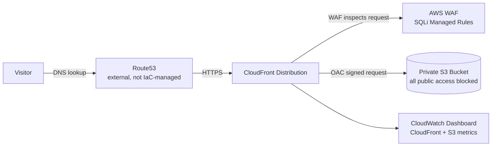
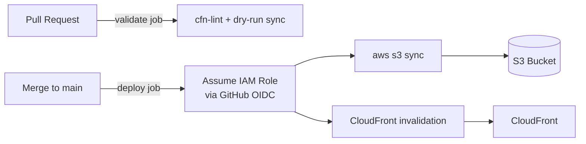

# Secure Static Website on AWS

[](https://github.com/bdahiya2007/secure-static-website-aws/actions/workflows/deploy.yml)

A production-style static website hosting architecture on AWS, built to demonstrate cloud architecture and cloud security engineering practices — a private-by-default origin, defense-in-depth at the edge, and a CI/CD pipeline with **zero long-lived AWS credentials**.

**Live demo:** https://securecloudengineers.com (served over a custom domain + ACM certificate, via CloudFront)

## What this demonstrates

- Designing a static-hosting architecture where the origin (S3) is never directly reachable, only through an authenticated CDN path
- Applying defense-in-depth at the edge: WAF, TLS enforcement, and origin access control layered together
- Replacing long-lived IAM credentials with short-lived, identity-federated (OIDC) access scoped to a single repository
- Writing least-privilege IAM policies scoped to specific resources, not wildcard access
- Building a CI/CD pipeline where changes are validated before merge and deployed automatically after
- Comparing architectural tradeoffs between a minimal setup and a hardened one (see [Two IaC paths](#two-iac-paths-on-purpose) below)

## Architecture





## Why this architecture

| Decision | Reasoning |
|---|---|
| S3 bucket blocks all public access | Content is reachable only via CloudFront — removes the entire "open S3 bucket" class of misconfiguration |
| CloudFront Origin Access Control (OAC) | The bucket policy trusts only this specific distribution's signed (SigV4) requests, not "any CloudFront distribution" and not the public internet |
| AWS WAF (CLOUDFRONT scope), managed SQLi rule set | Blocks — not just logs — requests matching AWS-managed SQL injection signatures, at the edge, before they reach the origin |
| HTTPS-only viewer policy | HTTP requests are redirected to HTTPS; no cleartext viewer traffic |
| GitHub OIDC instead of IAM access keys | The deploy role is assumed via a short-lived token scoped to this exact repository (matched against GitHub's OIDC `sub` claim) — no long-lived AWS credentials stored in GitHub, nothing to leak or rotate |
| Least-privilege deploy role | The IAM policy grants only `s3:{List,Get,Put,Delete}Object` on this one bucket and `cloudfront:CreateInvalidation` on this one distribution |
| Branch protection on `main` | Every change goes through a PR with a required, automated validation check; direct pushes and force-pushes are blocked |
| Custom domain is optional, not hardcoded | `Aliases`/`ViewerCertificate` are driven by parameters (`AlternateDomainNames`, `AcmCertificateArn`), gated by a condition — deploying without them still works, falling back to the default `*.cloudfront.net` certificate |
| DNS (Route53) is deliberately left out of this stack | The hosted zone for the demo domain has unrelated records (NS/SOA, an ACM validation CNAME) alongside the two alias records that point here; importing it into CloudFormation risks a conflicting-resource error on deploy. The two alias records pointing at CloudFront are managed manually instead |

## Repository structure

```
.
├── s3-static-website.yaml        # CloudFormation: S3 + CloudFront + OAC + WAF + CloudWatch + GitHub OIDC role
├── deploy.sh                     # Manual sync helper (aws s3 sync wrapper)
├── Deployment.md                 # Full step-by-step deployment guide
├── s3-static-website/            # Website content (demo storefront: HTML/CSS/JS)
├── terraform/                    # Alternate, simpler IaC path (see comparison below)
└── .github/workflows/deploy.yml  # CI/CD: PR validation + OIDC-based deploy on merge
```

## Two IaC paths, on purpose

This repo intentionally includes two different implementations of "serve a static site from S3," to show the tradeoff between the simplest possible setup and a hardened one:

| | `s3-static-website.yaml` (CloudFormation) | `terraform/` |
|---|---|---|
| Bucket access | Private; all public access blocked | Public read (`s3:GetObject` for everyone) |
| CDN | CloudFront with OAC | None — direct S3 website endpoint |
| TLS | Enforced (HTTP → HTTPS redirect) | Not available (S3 website endpoints are HTTP-only) |
| WAF | Yes — SQLi managed rule set | No |
| CI/CD | GitHub Actions with OIDC | Manual `terraform apply` |
| Use case | Production-facing, security-conscious deployment | Fastest way to get static files served from S3 |

## CI/CD pipeline

[`.github/workflows/deploy.yml`](.github/workflows/deploy.yml) runs two jobs, split by trigger:

- **`validate`** — on every pull request targeting `main`. Lints the CloudFormation template with `cfn-lint` and previews the S3 sync with `--dryrun`; no AWS resources are changed. This is a required status check, so a PR cannot merge until it passes.
- **`deploy`** — on push to `main` (i.e. after a PR merges). Syncs `s3-static-website/` to the bucket and creates a CloudFront invalidation.

Both jobs authenticate via GitHub's OIDC provider, assuming an IAM role whose trust policy is scoped to this exact repository — matched against GitHub's `sub` claim, including the immutable owner/repo IDs GitHub embeds in it. No `AWS_ACCESS_KEY_ID` / `AWS_SECRET_ACCESS_KEY` secrets exist anywhere in this repo.

## Deploying this yourself

See [Deployment.md](Deployment.md) for the full guide — prerequisites, all parameters, teardown, and troubleshooting. Quick version:

```bash
aws cloudformation deploy \
  --template-file s3-static-website.yaml \
  --stack-name my-static-site \
  --region us-east-1 \
  --capabilities CAPABILITY_NAMED_IAM \
  --parameter-overrides \
      BucketName=<your-globally-unique-bucket-name> \
      GitHubOrg=<your-github-username> \
      GitHubRepo=<your-repo-name>

aws s3 sync ./s3-static-website s3://<your-bucket-name>/
```

## Tech stack

AWS CloudFormation · Amazon S3 · Amazon CloudFront (OAC) · AWS WAFv2 · AWS IAM (OIDC federation) · Amazon CloudWatch · Amazon Route53 (DNS, managed separately from this stack) · Terraform (alternate path) · GitHub Actions
